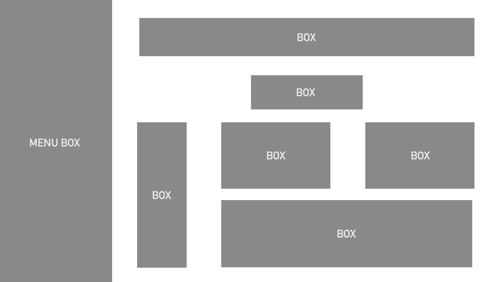
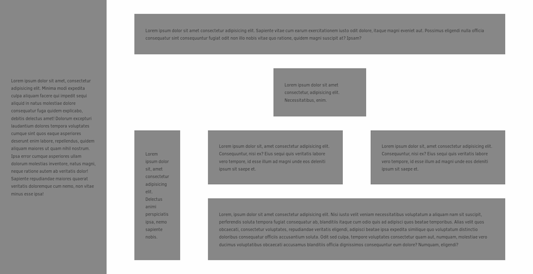

# HTML task

The task was to create an HTML + CSS website, which would be compatible with the attached scheme.

## Requirements

- External libraries are not allowed
- Inside the BOX and MENU BOX elements, place the lorem ipsum dummy text of the selected length
- Move the text away from the inside edges of the elements
- Adding or removing a piece of text should not significantly change the layout of the elements
- The MENU BOX element should occupy 100% of the browser window height and remain fixed to the screen despite scrolling
- The other elements should move with the scroll, if the height of the browser window doesn't allow them to be visible at the same time
- Space between elements and inside them can be arbitrarily chosen, but should be noticeable (values rather than 5 pixels)

## Display solution

To display the page, open the index.html file in a web browser

